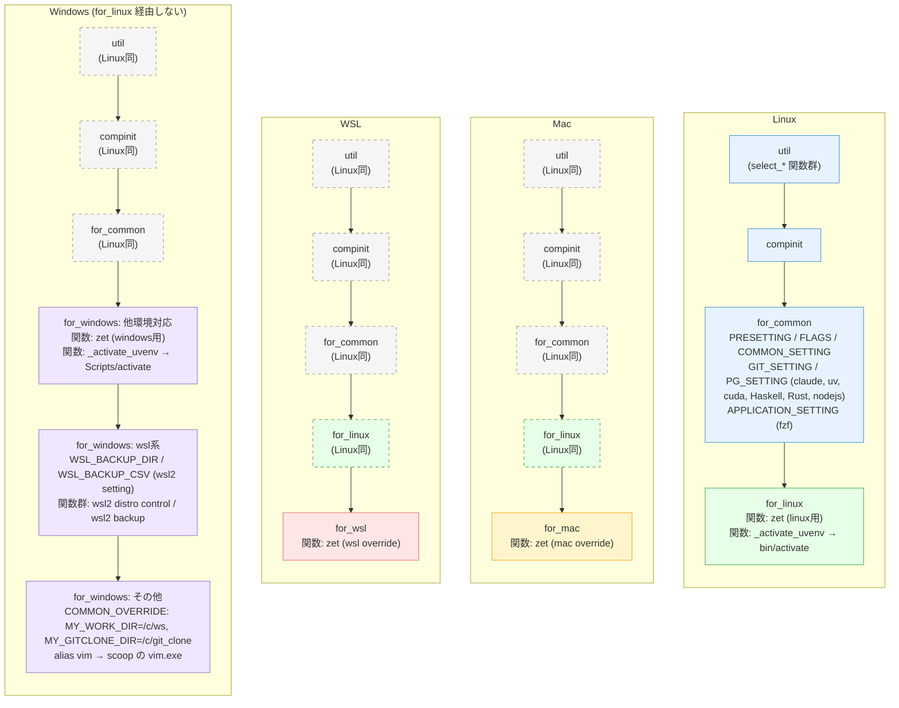

# dotfiles — LOAD_ORDER.md (PFDもどき)

> 各起動ルートで `dot_zshrc.sh` から始まるファイルロード順と、各ファイルの宣言タスク（関数定義以外）を俯瞰する。
> 特殊ルール: タスクのみ、オブジェクト省略（宣言列のため）。

---

## 起動ルート

各ルートでロードされるファイルと主要タスク。色: 青=全環境共通、緑=Unix基盤 (linux)、黄=Mac、赤=WSL、紫=Windows固有。

**Windows と Unix系の対応関係**（wsl2 関連を除く windows.sh の要素）:

| 機能 | Mac/Linux/WSL | Windows | 一致 |
|------|---------------|---------|------|
| `util` | ✓ (共通) | ✓ (共通) | ◯ |
| `compinit` | ✓ (共通) | ✓ (共通) | ◯ |
| `for_common` 内容 | ✓ (共通) | ✓ (共通) | ◯ |
| MY_WORK_DIR / MY_GITCLONE_DIR | common デフォルト (`$HOME/ws`, `$HOME/git_clone`) | windows.sh で override (`/c/ws`, `/c/git_clone`) | 差分 (意図的) |
| `zet` 関数 | for_linux/mac/wsl で OS別 | for_windows で windows用 | 各OS版あり |
| `_activate_uvenv` | for_linux で `bin/activate` (Mac/WSL は継承) | for_windows で `Scripts/activate` | 各OS版あり、パスのみ差分 |
| Windows固有の `alias vim` (scoop) | なし | windows.sh のみ | Windows固有 |

---

## 各ファイルの宣言タスク

### dot_zshrc.sh (エントリポイント、47行)
- `. ~/.zshrc_util` ロード
- `autoload -Uz compinit` + `compinit`
- `uname` で OS判定 → 該当ルートの環境別ファイルを順次ロード（Windows は `MINGW*_NT*` 統合）
- `CURR_OS` / `Platform` / `SHELL` を echo

### dot_zshrc_util.sh (汎用ユーティリティ、186行)
- (関数定義のみ: `select_items_stepwise`, `select_1_item`, `select_items_at_once`)

### dot_zshrc_for_common.sh (全環境共通、516行)
**PRESETTING**
- `export TWILIO_ACCOUNT_SID=""` / `TWILIO_AUTH_TOKEN=""` （空）
- `MY_WORK_DIR` / `MY_GITCLONE_DIR` のデフォルト設定 (`$HOME/ws`, `$HOME/git_clone`)

**FLAGS_FOR_SETTING**
- `MY_FLG_FZF` / `MY_FLG_GIT` / `MY_FLG_EXA` （コマンド存在チェック）

**COMMON_SETTING**
- Language: `LANGUAGE` / `LC_ALL` / `LC_CTYPE` / `LANG` を `ja_JP.UTF-8` で export
- Zsh: `setopt no_beep`, `HISTFILE` / `HISTSIZE` / `SAVEHIST` / hist_* setopt
- Prompt: `PROMPT` 設定
- alias: `zrc`, `his`, `vi`, `vet`, `..`, `ll`, `lll`, `lld`, `cdd`, `cdw`, `cdg`, `cdgd`, `mkbdnv` / `mkbdcd` / `mkbdmk`
- Hook: `precmd` / `chpwd` 定義

**GIT_SETTING** (条件: `MY_FLG_GIT`)
- alias: `gisw`, `gicm`, `giad`, `gist`

**PG_SETTING**
- claude: alias `claude=_claude_using_session` （条件: `claude` 存在）
- Python: `export PYTHONIOENCODING=utf-8`
  - uv: `PATH=$HOME/.local/bin:$PATH`, alias `uva`/`uvd`/`uvm`（条件: `uv` 存在）
- cuda: `PATH=/usr/local/cuda/bin:$PATH`
- Haskell: `$HOME/.ghcup/env` source, alias `-s hs` （条件: `~/.ghcup/env` 存在）
- Rust: `PATH=$HOME/.cargo/bin:$PATH` （条件: `~/.cargo/` 存在）
- nodejs: `NVM_DIR=$HOME/.nvm`, `nvm.sh` source, npm PATH 追加 （条件付き）

**APPLICATION_SETTING**
- fzf: `.fzf.bash` source, `ENHANCD_FILTER=fzf` （条件: `MY_FLG_FZF`）

### dot_zshrc_for_linux.sh (Linux/Mac/WSL 共通基盤)
- (関数定義: `zet`, `_activate_uvenv` (bin/activate版))
- 注: `MY_WORK_DIR` / `MY_GITCLONE_DIR` は common デフォルトに任せる

### dot_zshrc_for_mac.sh (Mac 固有)
- (関数定義: `zet` (mac用))

### dot_zshrc_for_wsl.sh (WSL 固有)
- (関数定義: `zet` (wsl用))

### dot_zshrc_for_windows.sh (Windows 固有、908行)
**COMMON_OVERRIDE**
- `MY_WORK_DIR="/c/ws"` / `MY_GITCLONE_DIR="/c/git_clone"` ※common デフォルトを意図的に上書き（アドレスバー直打ち用）

**UNIQUE_SETTING**
- alias `vim` for scoop (条件: `$HOME/scoop/shims/vim.exe` 存在)
- `WSL_BACKUP_DIR` / `WSL_BACKUP_CSV` セット (wsl2 setting)
- (関数定義多数: `zet`, `_activate_uvenv` (Scripts/activate版), wsl2 distro control 群、wsl2 バックアップ群など)

---

## 残った所見

1. **Mac は `MY_WORK_DIR` / `MY_GITCLONE_DIR` を明示設定していない** — common のデフォルト (`$HOME/ws`) で動く。Mac固有のパスを使いたい場合は `dot_zshrc_for_mac.sh` に `COMMON_OVERRIDE` ブロックを追加（現状は不要、情報共有のみ）。

---

## 対処履歴

- 2026-05-18: Phase 5.0.0 にて以下を対処済み
  - ghcup ハードコード修正
  - PRE_CALLING_COMMON → COMMON_OVERRIDE リネーム
  - MINGW32_NT* / MINGW64_NT* の case 統合
  - dot_zshrc_for_mac.sh の二重 UNIQUE_SETTING フラット化
  - Linux/WSL の MY_WORK_DIR 重複削除
